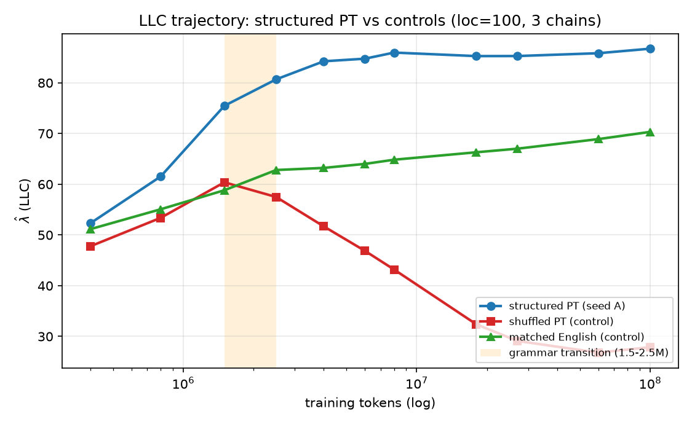
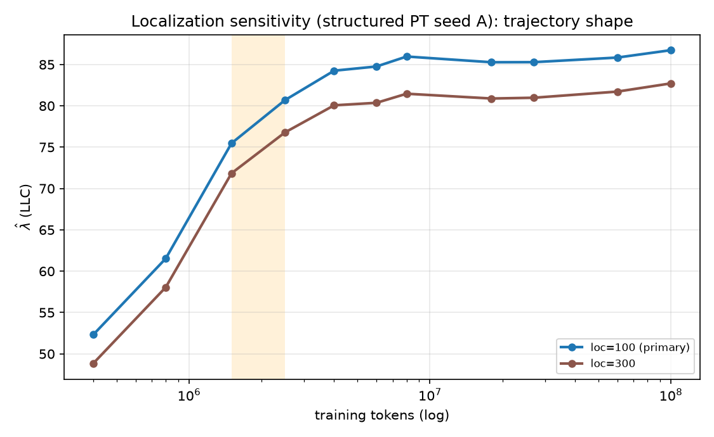

# Controls + robustness: the LLC changepoint is specific to Portuguese acquisition

_Three-condition LLC contrast (structured PT seed A vs token-shuffled PT vs matched English) plus a
localization-sensitivity check on the primary condition. All trajectories use one global sampler config
(3 chains, lr 1e-5, n_beta 10, batch 64, 200 burn-in + 100 draws), each condition measured against a
**condition-matched non-padded reference** built from its own training chunks. Generated 2026-06-21 from
an unattended overnight VM run; data behind every figure is committed alongside this report._

## TL;DR

The steep LLC rise-then-plateau we found for structured Portuguese (seed A) **is not reproduced by either
control**, and **is robust to the localization hyperparameter**:

- **Token-shuffled PT** (same tokens, word order destroyed): LLC rises only weakly to ~60 by 1.5M then
  **declines monotonically to ~28** — the opposite of a sustained changepoint.
- **Matched English** (same protocol, different language — controls for "any continued pretraining raises
  complexity"): LLC rises **smoothly and gently to ~70**, with **no steep transition and no high plateau**.
- **Localization sensitivity:** at loc=300 the structured-PT trajectory is ~4 LLC-units lower everywhere
  but **identical in shape** (same rise through 1.5–2.5M, same plateau), so the changepoint is not an
  artifact of the loc=100 choice.

This completes the three AGENTS.md-minimum conditions (structured / shuffled / matched-English) with valid
positive LLC trajectories, and adds a robustness check. The structured-PT geometric changepoint that
brackets the grammar-acquisition transition is **specific to genuine Portuguese structure being acquired**
— not an artifact of training length, token statistics, generic adaptation, or sampler localization.

> Caveat carried forward: this is still **one Portuguese seed**. Replication (seed B) needs a clean
> training run and is the next step — see [Limitations](#limitations).

## 1. Three-condition contrast

| tokens | structured PT (A) | shuffled PT | matched EN |
|---:|---:|---:|---:|
| 400k | +52.3 | +47.8 | +51.2 |
| 800k | +61.5 | +53.4 | +55.1 |
| 1.5M | +75.5 | **+60.4** (peak) | +58.8 |
| 2.5M | +80.7 | +57.5 | +62.8 |
| 4M | +84.3 | +51.7 | +63.2 |
| 8M | +86.0 | +43.2 | +64.8 |
| 27M | +85.3 | +29.1 | +67.0 |
| 100M | +86.7 | **+27.9** | +70.3 |

Three qualitatively different trajectories from the same architecture, optimizer, token budget, and
sampler:

- **Structured PT** — steep rise concentrated in 400k–2.5M (bracketing the behavioral grammar transition),
  then a high plateau (~85). The aligned-changepoint signature.
- **Shuffled PT** — with word order destroyed there is no grammar to acquire; local complexity rises only
  to ~60, peaks at 1.5M, then **falls steadily to ~28** as the model settles into low-complexity
  position-independent (≈unigram) statistics. No changepoint; the trend after 1.5M is *downward*.
- **Matched English** — the model genuinely adapts (complexity rises monotonically 51→70), but **smoothly
  and to a markedly lower level**, with no steep transition and no plateau at the structured level. This is
  the key control: it shows the structured signature is not just "continued pretraining raises LLC."

At 100M the three are cleanly separated — structured +87, English +70, shuffled +28 — and the structured
condition is the only one with both the steep grammar-window rise and the high plateau.

## 2. Localization sensitivity (structured PT seed A)

| tokens | loc=100 (primary) | loc=300 |
|---:|---:|---:|
| 400k | +52.3 | +48.8 |
| 1.5M | +75.5 | +71.8 |
| 2.5M | +80.7 | +76.8 |
| 8M | +86.0 | +81.5 |
| 100M | +86.7 | +82.7 |

The localization parameter sets the SGLD prior strength around the checkpoint, so it shifts the absolute
LLC level — loc=300 sits ~4 units below loc=100 everywhere. But the **shape is preserved exactly**: same
steep rise through 1.5–2.5M, same plateau onset, same flat tail. The changepoint is a property of the
trajectory, not of the localization choice. (A second point, loc=30, was queued but skipped — the run hit
the overnight halt deadline first; loc=300 alone establishes shape-invariance over a 3× range of loc.)

## Methods note (validity)

Each condition's LLC is measured against a reference built from **its own** training distribution
(`build_packed_reference.py`, 256 non-padded full-length chunks), because λ̂ is only valid at a minimum of
the loss the model actually minimised. Using the structured-PT reference for the shuffled or English models
would measure a loss they never optimised and produce meaningless estimates. The localization-sensitivity
runs reuse the exact seed-A selection and structured reference, varying only `--localization`. All runs
share the one global sampler config; all checkpoints are positive with no rejected chains.

## Limitations

1. **Single Portuguese seed.** The controls strengthen specificity, but replication (a second PT seed) is
   not yet done — it needs a clean training run (re-running training in place would clobber the checkpoints
   these LLC jobs read). This is the top next step.
2. **No formal statistical changepoint/alignment test yet** — the "rise brackets the transition" and
   "controls are flat/declining" reads are from the trajectories, not a fitted changepoint model.
3. **Localization sensitivity is one alternate point (loc=300).** loc=30 was skipped at the overnight
   deadline; worth adding for a fuller sweep, though 100↔300 already shows shape-invariance.
4. **Behavioral grammar curve exists for structured PT only.** The controls have BPB but the 538-item
   grammar benchmark was not scored for them (shuffled has no word-order grammar to test; English is
   off-task) — fine for the LLC contrast, noted for completeness.
5. **Bookkeeping:** all three overnight LLC jobs exited non-zero on the same cosmetic
   `KeyError: 'estimated_cost_usd'` (`llc_campaign.py:652`) *after* sampling all 11 checkpoints — no
   scientific output affected (the summaries confirm 11/11). The one-line fix is still open, as is the
   in-loss padding-mask TODO.

## What this completes / next

- ✅ All three AGENTS.md-minimum conditions now have valid LLC trajectories with a clean contrast.
- ✅ Localization-shape robustness (loc 100 vs 300).
- ⏭ **seed-B replication** (clean training run + LLC) — the main remaining piece for a claim.
- ⏭ Statistical changepoint/alignment test; loc=30 (and maybe loc=1000) to round out the sensitivity sweep.
- ⏭ Fix the cosmetic cost-manifest `KeyError` and add in-loss padding masking.

## Reproducing

Data behind every figure is committed next to this report:
[`structured_seedA_loc100_llc.json`](structured_seedA_loc100_llc.json),
[`shuffled_pt_llc.json`](shuffled_pt_llc.json), [`matched_en_llc.json`](matched_en_llc.json),
[`seedA_loc300_llc.json`](seedA_loc300_llc.json). Figures regenerate via `scripts/overnight_report.py`.
Heavy artifacts (checkpoints, SGLD zarr traces) stay on the VM / boot-disk snapshot, gitignored.
