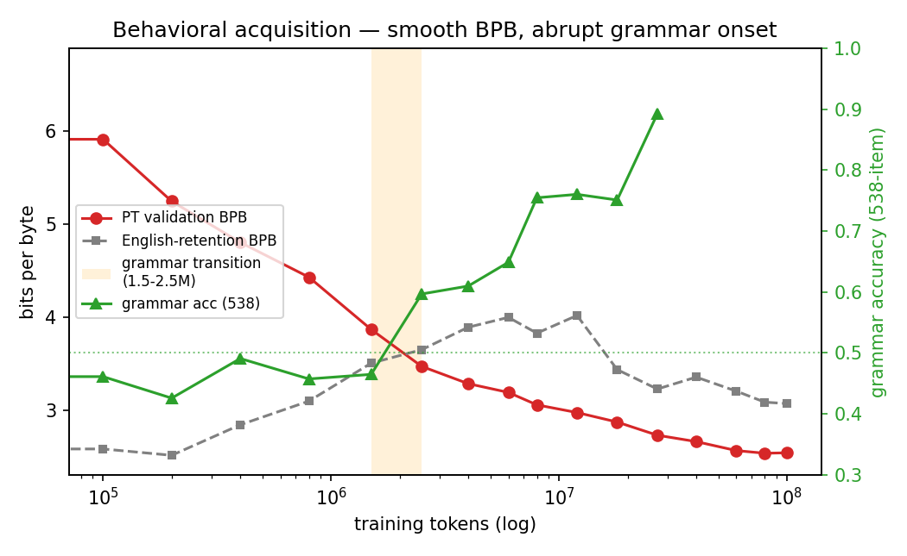
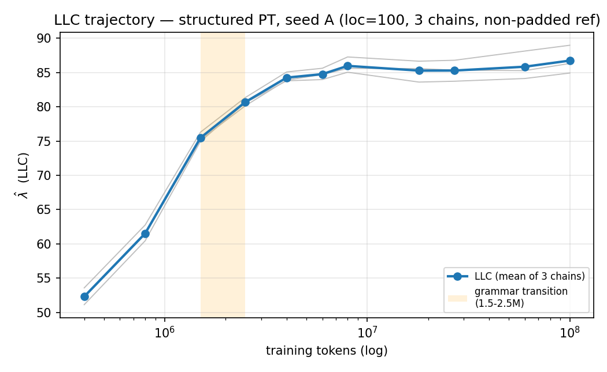
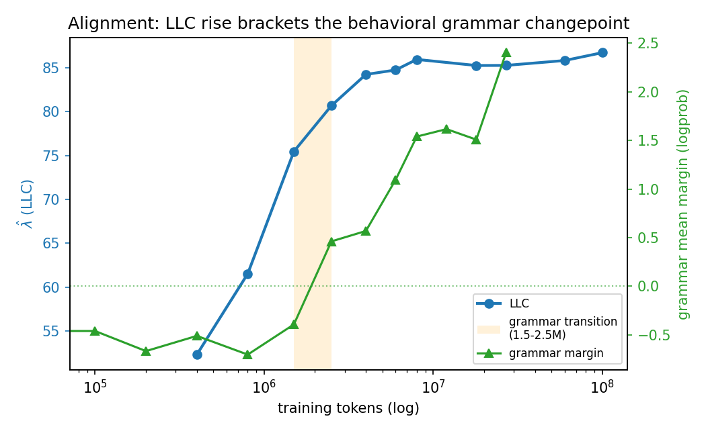

# Seed-A LLC trajectory: a geometric changepoint aligned with Portuguese grammar acquisition

_Primary condition (structured PT, seed A), 100M-token continued-pretraining run + full LLC trajectory._
_Run dirs: `results/02_final_training/final_training_20260620T175233Z_wiki100m` (training/behavior),_
_`results/03_llc_campaign/seed_a_FINAL_20260621T001501Z` (LLC). Generated 2026-06-21._

_Status update for submission: this remains the primary seed-A trajectory report. The missing-control and
localization caveats from the first draft are now addressed in
`reports/control_comparison/REPORT.md`; the remaining major robustness limitation is second-seed
replication._

## TL;DR

As TinyStories-8M is adapted to Portuguese by full-parameter continued pretraining, an **SLT-derived
local geometric quantity — the Local Learning Coefficient (LLC, $\hat\lambda$) — rises steeply through a
narrow training window (≈400k–2.5M tokens) and then plateaus.** That rise **brackets the behavioral
onset of Portuguese grammatical competence** (538-item minimal-pair accuracy goes from chance to ~89%,
with the margin flipping negative→positive at ~2.5M tokens), even though the raw modeling loss (PT
bits-per-byte) falls **smoothly and monotonically** with no kink. This is the aligned-changepoint
signature we set out to look for.

> **This is the primary single-seed trajectory.** Read it together with
> `reports/control_comparison/REPORT.md`, which adds the shuffled-Portuguese and matched-English LLC
> controls plus localization robustness. The remaining major robustness gap is second-seed replication.

## Research question

Does an SLT-derived geometric quantity (the LLC / RLCT, estimated by SGLD) change in a way that **aligns
with a behavioral/developmental transition** as a small English-trained LM acquires Portuguese? A model
merely learning Portuguese is not a result; the geometric↔behavioral alignment is.

## Setup

**Training (frozen recipe).** `roneneldan/TinyStories-8M`, full-parameter FP32 AdamW, lr 1e-4, 3% warmup,
cosine decay, grad-clip 1.0, weight_decay 0.01, batch 64, sequence length 128, Wikipedia-PT corpus
(`wikimedia/wikipedia`, `20231101.pt`), seed 202606201. Trained to **100M tokens** with 17 saved
checkpoints. This recipe was found by a short autoresearch loop after an initial run (8M tokens, lr 3e-4
flat) failed to learn (see the decision log and PROJECT_STATUS).

**Behavioral benchmarks (every checkpoint).** PT validation BPB and English-retention BPB on
`Helsinki-NLP/opus-100` (en-pt, 512 examples); a **538-item templated Portuguese grammatical
minimal-pair benchmark** (`data/eval/pt_minimal_pairs.jsonl`, 10 agreement phenomena, frozen + hashed;
generator/scorer in `scripts/`). Accuracy = fraction of pairs with logprob(grammatical) >
logprob(ungrammatical); we also report the mean logprob margin.

**LLC (the geometric quantity).** `scripts/llc_campaign.py`, devinterp SGLD, **localization (loc) = 100,
3 chains**, one globally fixed sampler configuration across all checkpoints (per AGENTS.md rule 5). The
sampling reference is a **non-padded** set of full-length Wikipedia-PT training chunks
(`scripts/build_packed_reference.py`) — this matters, see [The LLC debugging arc](#the-llc-debugging-arc).
$\hat\lambda = n_\beta\,(\mathbb{E}[\text{sampled loss}] - \text{init loss})$; positive at a true local
minimum of the measured loss.

## Results

### 1. Behavioral acquisition: smooth loss, abrupt grammar

PT BPB falls smoothly **6.69 → 2.54** (monotonic, no kink). English retention degrades then partially
recovers (catastrophic-forgetting-then-recovery; 2.71 → ~4.0 peak ≈12M → 3.07 at 100M). Grammar
competence, by contrast, emerges **abruptly**: flat at chance through 1.5M tokens, then the mean margin
flips negative→positive between 1.5M and 2.5M and accuracy climbs to **89.2% by 27M**.

| tokens | PT BPB | EN BPB | grammar acc (538) | grammar margin |
|---:|---:|---:|---:|---:|
| 0 | 6.686 | 2.714 | 0.446 | −0.277 |
| 400k | 4.805 | 2.843 | 0.491 | −0.512 |
| 800k | 4.431 | 3.098 | 0.457 | −0.705 |
| 1.5M | 3.869 | 3.506 | 0.465 | −0.394 |
| **2.5M** | 3.471 | 3.651 | **0.597** | **+0.461** |
| 4M | 3.285 | 3.893 | 0.610 | +0.568 |
| 8M | 3.057 | 3.829 | 0.755 | +1.540 |
| 27M | 2.731 | 3.228 | 0.892 | +2.403 |
| 100M | 2.541 | 3.071 | — | — |

_(Grammar benchmark was scored on checkpoints 0–27M; BPB on all 17 to 100M. The transition is well before
27M, so the curve covers it.)_

### 2. LLC trajectory: steep rise then plateau

| tokens | LLC (mean) | per-chain |
|---:|---:|:--|
| 400k | +52.3 | 53.6 / 52.2 / 51.1 |
| 800k | +61.5 | 62.8 / 61.4 / 60.5 |
| 1.5M | +75.5 | 76.3 / 75.2 / 74.9 |
| 2.5M | +80.7 | 81.3 / 80.1 / 80.6 |
| 4M | +84.3 | 85.1 / 83.9 / 83.8 |
| 6M | +84.8 | 85.6 / 84.7 / 84.0 |
| 8M | +86.0 | 87.3 / 85.6 / 85.0 |
| 18M | +85.3 | 86.6 / 85.6 / 83.6 |
| 27M | +85.3 | 86.8 / 85.3 / 83.7 |
| 60M | +85.8 | 88.1 / 85.3 / 84.1 |
| 100M | +86.7 | 89.0 / 86.3 / 84.9 |

LLC is **positive at every checkpoint, with tight chain agreement (spread ≈1–4) and zero rejected
chains.** It rises ≈34 points over 400k→4M (the steep portion concentrated in 400k–2.5M) and then is flat
within noise (≈84–87) for the remaining 25× of training.

### 3. Alignment

The steep LLC rise **brackets the behavioral grammar changepoint**: the geometry reorganizes through
≈400k–2.5M, the grammar margin crosses zero at ≈2.5M, and both then settle (LLC plateaus; grammar keeps
climbing more gradually to its 89% ceiling). Read honestly, **the LLC rise slightly *leads* the
behavioral expression** — local complexity increases first, grammatical behavior follows and continues
maturing after the geometric quantity has plateaued. That the abruptness appears in the LLC and in
discrete grammar accuracy but **not** in the smooth BPB curve is the interesting part: a geometric and a
behavioral changepoint coincide where the modeling-loss curve shows nothing.

Per AGENTS.md rule 7, we call this **"a changepoint in an SLT-derived local geometric estimate aligned
with a behavioral transition,"** not a formal SLT phase transition.

## The LLC debugging arc

This result only exists after fixing a real measurement bug — recorded here because it is the main
epistemic lesson and a reviewer will (rightly) ask.

1. **First LLC runs were negative at every checkpoint**, including the deepest 100M minimum. We initially
   (wrongly) read the campaign's accept/reject *label* as validity — but "accepted" only means "not
   severely downhill," **not** "positive." Always read the **actual value, sign, and chain agreement.**
2. Sweeping lr and localization could not fix it (lr→0 ⇒ LLC→0 from below; batch-size invariant) — the
   fingerprint of "the checkpoint is not a minimum of the loss being *measured*."
3. **Root cause (a data/loss-definition bug):** the sampler reference was built from short OPUS sentences
   (~30 chars) **padded to 128 tokens with eos and never masked** — so ≈90% of every scored sequence was
   unmasked eos-prediction. The checkpoint minimizes the training loss, not that padded loss, so
   $\hat\lambda$ was negative everywhere.
4. **Fix:** rebuild the reference from full-length **non-padded** Wikipedia-PT training chunks
   (`scripts/build_packed_reference.py`; the buggy original is retained as
   `…/data_splits/sampler_reference.jsonl.orig`). With it, $\hat\lambda$ is positive and accepted
   everywhere. The original `loc=100` config was fine all along — the reference was the bug.

## Validity diagnostics

- **Sign/magnitude:** positive at all 11 checkpoints (+52 → +87).
- **Chain agreement:** 3 chains, per-checkpoint spread ≈1–4; no chain rejected by the campaign's
  reject-diagnostic.
- **Reference sanity:** non-padded reference re-encodes to full 128-token sequences (no padding leakage).
- **Monotone-then-flat structure** rather than noise: the shape is stable and interpretable.

## Limitations

These bound the claim.

1. **Single Portuguese seed.** The shuffled-PT and matched-English controls now establish specificity, and
   the localization check supports trajectory-shape robustness, but a second independently seeded
   structured-Portuguese trajectory is still needed for a stronger replication claim.
2. **No formal statistical changepoint/alignment test yet.** The "rise brackets the transition" reading is
   from the trajectories, not a fitted changepoint model with a significance statement.
3. **In-loss padding masking is still open code hygiene.** The fix works via the repacked non-padded
   reference, but `llc_campaign.py` does not yet mask padding *in the loss* (proper labels /
   ignore_index). The result is correct for this reference; the code is not yet robust to an arbitrary
   one.
4. **Grammar benchmark scored to 27M, not 100M** (the transition is well before, so this doesn't affect
   the changepoint, but the late curve is BPB-only). The benchmark is templated, not a validated BLiMP-PT.
5. **Bookkeeping:** the LLC job exited non-zero on a cosmetic `KeyError: 'estimated_cost_usd'` in the
   final-manifest writeout (`llc_campaign.py:652`), *after* all 11 checkpoints were sampled and accepted.
   No scientific output is affected; the manifest cost field is missing. Worth a one-line fix.

## Next steps (in priority order)

See the current archived follow-up list in `../../FUTURE_WORK.md`. In short:

1. **Seed-B replication** (clean second structured-Portuguese training run + LLC).
2. **Statistical changepoint analysis** quantifying the LLC changepoint and its alignment with the
   ~1.5–2.5M behavioral transition.
3. Harden `llc_campaign.py` (mask padding in-loss; fix the cost-manifest KeyError).
4. Literature framing vs prior LLC-during-training / developmental-interpretability work (novelty).

## Reproducing the numbers/figures

Data behind every figure is committed next to this report:
- [`llc_curve.json`](llc_curve.json) — per-checkpoint LLC mean + per-chain.
- [`behavioral_bpb.json`](behavioral_bpb.json) — PT/EN BPB per checkpoint.
- [`grammar538.json`](grammar538.json) — 538-item accuracy/margin per checkpoint.

Figures regenerate from these three files (matplotlib). Heavy artifacts (checkpoints, SGLD zarr traces,
tokenized corpora) stay on the VM / boot-disk snapshot and are gitignored.
