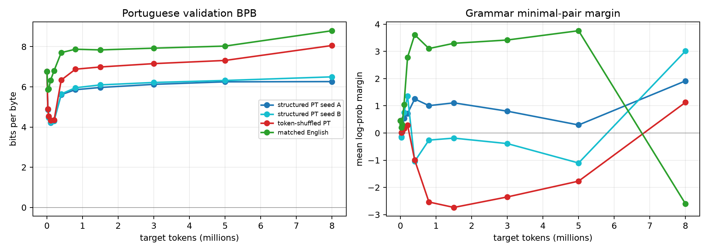
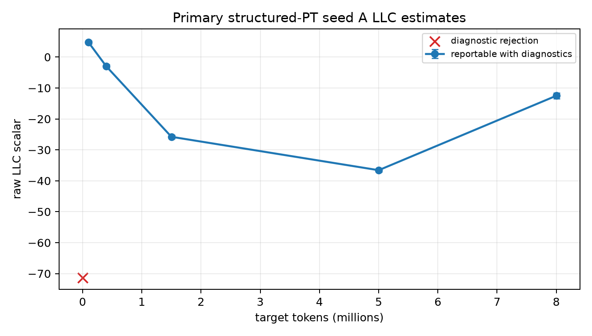
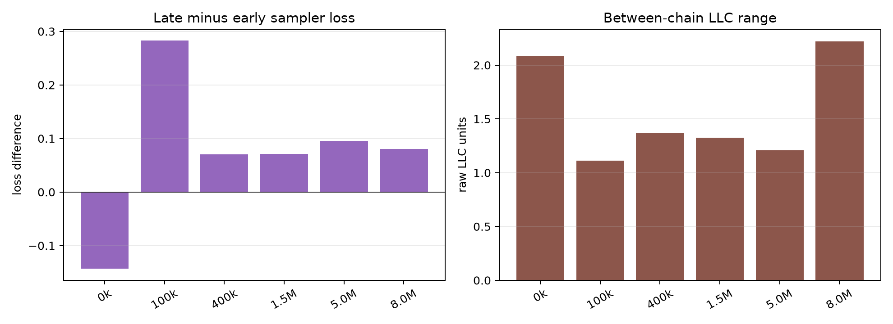
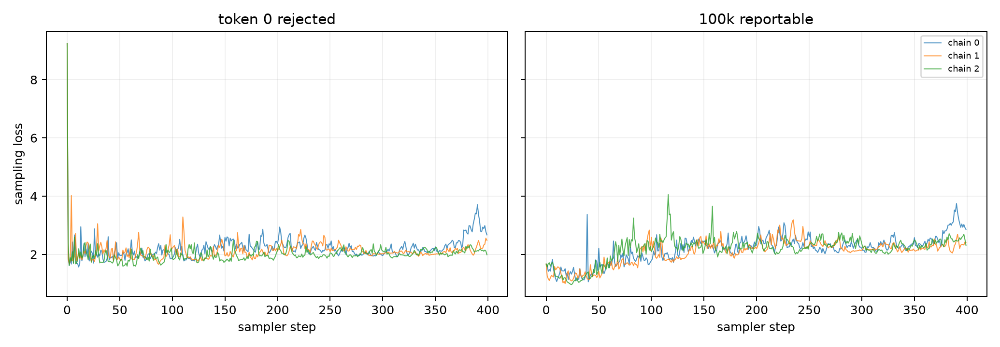

# When Does a Small Model Learn Portuguese?

Run ID: `report_20260620T064400Z_final_training_20260620T053855Z_batch16`  
Generated: `2026-06-20T06:46:41Z`  
Status: empirical / methodological, with a reportable limitation rather than a formal phase-transition claim.

## Abstract

We adapted `roneneldan/TinyStories-8M` by full-parameter FP32 next-token continued pretraining on a frozen Portuguese split, with token-shuffled Portuguese and matched-English controls plus a second structured-Portuguese seed. Behavior was evaluated at every saved checkpoint. LLC was measured only for the primary structured-Portuguese seed A at a frozen behavior-selected subset using one global sampler configuration.

The real outputs show early Portuguese BPB improvement followed by later degradation, noisy grammar margins on only 10 constructed minimal pairs, and a non-monotone primary LLC trajectory after excluding the token-0 diagnostic rejection. This is not sufficient to claim a changepoint in an SLT-derived local geometric estimate aligned with a behavioral transition: LLC controls were not run, token 0 was rejected, and the grammar sanity-check file has `passed=false` because items 3, 4 do not meet the shared-prefix check. The useful result is a reproducible diagnostic package for a narrow adaptation trajectory.

## 1. Experimental design

- Model: `roneneldan/TinyStories-8M`, full-parameter continued pretraining, FP32, sequence length 128.
- Conditions: structured Portuguese seed A, structured Portuguese seed B, token-shuffled Portuguese, and matched English.
- Data source for the report: only `results/02_final_training/final_training_20260620T053855Z` and `results/03_llc_campaign/llc_campaign_final_training_20260620T053855Z_batch16`.
- Behavior: Portuguese validation BPB, English-retention BPB, and Portuguese grammar minimal-pair margin at all checkpoints.
- LLC: primary structured-Portuguese seed A only, selected tokens `0,100000,400000,1500000,5000000,8000000`, fixed sampler reference set hash `b9a366d668658bb1d8fda5143aeae70c3c08b439ac10bb34fc33966fc5e4752f`.
- Sampler: FP32 full-parameter SGLD, 3 chains, 200 burn-in steps, 100 draws, 2 steps between draws, batch size 16, fixed across all selected checkpoints.

## 2. Behavioral endpoint table

Every cell in this table is generated from condition summary JSON files and checked in `validation/table_cell_verification.csv`.

| condition | final_tokens | pt_bpb_initial | pt_bpb_final | pt_bpb_delta | grammar_margin_final | grammar_margin_95pct_ci | grammar_accuracy_final | english_bpb_final | english_bpb_delta |
| --- | --- | --- | --- | --- | --- | --- | --- | --- | --- |
| structured PT seed A | 8000000 | 6.7735 | 6.2615 | -0.5120 | 1.9165 | [-2.2673, 6.9216] | 0.600 | 4.3922 | 1.6746 |
| structured PT seed B | 8000000 | 6.7735 | 6.4980 | -0.2756 | 3.0162 | [-2.4888, 9.5349] | 0.700 | 4.7117 | 1.9941 |
| token-shuffled PT | 8000000 | 6.7735 | 8.0578 | 1.2842 | 1.1275 | [-3.6533, 7.8160] | 0.400 | 5.1454 | 2.4279 |
| matched English | 8000000 | 6.7735 | 8.7935 | 2.0200 | -2.6044 | [-8.4135, 2.5691] | 0.400 | 3.8660 | 1.1484 |



Source data: `source_tables/behavior_trajectory_source.csv`.

## 3. LLC and alignment screen

The LLC scalar for token 0 is retained in the source table but rejected for reporting because diagnostics flagged `persistent_downhill_movement_below_center`. The remaining five selected checkpoints have chain diagnostics and raw traces. The primary LLC curve is non-monotone: it decreases through 5M tokens and rebounds by 8M tokens. Because only the primary condition was sampled for LLC, this is an association screen rather than a controlled geometric claim.

| target_tokens | actual_tokens | pt_bpb | grammar_margin | grammar_accuracy | llc_scalar | llc_std | llc_status | rejection_reason |
| --- | --- | --- | --- | --- | --- | --- | --- | --- |
| 0 | 0 | 6.7735 | 0.4555 | 0.400 | -71.3304 | 0.8505 | rejected | persistent_downhill_movement_below_center |
| 100000 | 102400 | 4.2141 | 0.5383 | 0.700 | 4.7676 | 0.5079 | reportable_with_diagnostics |  |
| 400000 | 401408 | 5.6123 | 1.2533 | 0.500 | -2.9916 | 0.6158 | reportable_with_diagnostics |  |
| 1500000 | 1503232 | 5.9696 | 1.1091 | 0.500 | -25.7766 | 0.5921 | reportable_with_diagnostics |  |
| 5000000 | 5001216 | 6.2501 | 0.2961 | 0.600 | -36.5764 | 0.5695 | reportable_with_diagnostics |  |
| 8000000 | 8003584 | 6.2615 | 1.9165 | 0.600 | -12.5067 | 0.9708 | reportable_with_diagnostics |  |



## 4. Chain diagnostics

The sampler diagnostics table reports loss drift, between-chain range, and displacement summaries. Token 0 is explicitly marked as a diagnostic rejection. Chain-level zarr traces, running estimates, and displacement JSONL files are preserved under the LLC run directory.

| checkpoint | target_tokens | init_loss | early_mean_loss | late_mean_loss | late_minus_early | between_chain_range | distance_max | status | rejection_reason |
| --- | --- | --- | --- | --- | --- | --- | --- | --- | --- |
| tokens_000000000 | 0 | 9.2486 | 2.1652 | 2.0217 | -0.1435 | 2.0815 | 254.67 | rejected | persistent_downhill_movement_below_center |
| tokens_000100000 | 100000 | 1.6667 | 2.0671 | 2.3498 | 0.2827 | 1.1118 | 254.67 | reportable_with_diagnostics |  |
| tokens_000400000 | 400000 | 2.5393 | 2.2502 | 2.3209 | 0.0708 | 1.3667 | 254.67 | reportable_with_diagnostics |  |
| tokens_001500000 | 1500000 | 4.8257 | 2.2512 | 2.3227 | 0.0715 | 1.3266 | 254.67 | reportable_with_diagnostics |  |
| tokens_005000000 | 5000000 | 5.9021 | 2.2356 | 2.3313 | 0.0957 | 1.2082 | 254.67 | reportable_with_diagnostics |  |
| tokens_008000000 | 8000000 | 3.2526 | 1.9704 | 2.0512 | 0.0808 | 2.2225 | 254.67 | reportable_with_diagnostics |  |





## 5. Uncertainty, failure modes, and cost

Uncertainty sources are checkpoint density, tiny grammar evaluation size, the failed constructed-pair shared-prefix sanity check, bootstrap uncertainty over only 10 grammar pairs, repeated use of a small frozen split to reach 8M target tokens, and the lack of LLC controls or second-seed LLC. The smooth/null alternative remains plausible: Portuguese behavior may be mostly local-sequence adaptation plus overfitting, while the LLC trajectory may be sampler/reference-set dependent rather than a stable geometric marker.

| phase | run_id | gate_decision | wall_minutes | gpu_hours | estimated_cost_usd | projected_total_cost_usd |
| --- | --- | --- | --- | --- | --- | --- |
| final_behavior_training | final_training_20260620T053855Z | proceed_to_llc | 8.59 | 0.1432 | $0.1432 | $0.2469 |
| llc_campaign | llc_campaign_final_training_20260620T053855Z_batch16 | llc_complete_with_rejections | 36.18 | 0.6029 | $0.6029 | $0.8506 |

Failure modes retained in the report package:

- Token-0 LLC rejection for persistent downhill movement below center.
- No LLC estimates for shuffled Portuguese, matched English, or structured Portuguese seed B.
- English retention BPB worsens during Portuguese adaptation in the Portuguese conditions.
- Grammar margins are unstable and based on 10 items; grammar sanity checks are not all passed.
- The report does not infer causality or a formal SLT phase transition.

## 6. Reproducibility

| item | value | evidence |
| --- | --- | --- |
| model | roneneldan/TinyStories-8M | results/02_final_training/final_training_20260620T053855Z/manifest.json |
| final_training_source_commit | 98913e931d2dd1ea4453a519b2ff860008cffb69 | results/02_final_training/final_training_20260620T053855Z/manifest.json |
| llc_campaign_source_commit | 67686c00f3e65ac97466338522667bc9c8af1b9c | results/03_llc_campaign/llc_campaign_final_training_20260620T053855Z_batch16/manifest.json |
| tokenizer_vocab_sha256 | e35d8b86ebd35ebd260d040aa455e09759f7e675f4dbb7f3d727516f27eca190 | results/02_final_training/final_training_20260620T053855Z/manifest.json |
| frozen_config_sha256 | 6046581a0ce97c4c58390aea321b81109994cd65145ca31866a0ad955dbe9eac | results/02_final_training/final_training_20260620T053855Z/frozen_config.json |
| split_manifest_sha256 | d437524bb70b6bf4a7e3a912c71c613a678572410d1aacbb8b6ccfa7dd5e7af6 | results/02_final_training/final_training_20260620T053855Z/data_splits/split_manifest.json |
| sampler_reference_sha256 | b9a366d668658bb1d8fda5143aeae70c3c08b439ac10bb34fc33966fc5e4752f | results/03_llc_campaign/llc_campaign_final_training_20260620T053855Z_batch16/manifest.json |
| sampler_config_sha256 | e091991be4d20e215b8a9937eea9ade19dc371bee758ccffad1c7f76638218cd | results/03_llc_campaign/llc_campaign_final_training_20260620T053855Z_batch16/sampler_config.json |
| selected_llc_tokens | 0,100000,400000,1500000,5000000,8000000 | results/03_llc_campaign/llc_campaign_final_training_20260620T053855Z_batch16/manifest.json |

Additional machine-readable artifacts:

- `source_tables/selected_checkpoint_hashes.csv`
- `source_links.json`
- `validation/table_cell_verification.csv`
- `validation/validation_summary.json`
- Figures under `figures/`
- PDF copy at `report.pdf`

One-command rerun:

```bash
.venv-bench-py311/bin/python scripts/build_report.py --run-id report_20260620T064400Z_final_training_20260620T053855Z_batch16 --output-dir results/04_report/report_20260620T064400Z_final_training_20260620T053855Z_batch16
```
